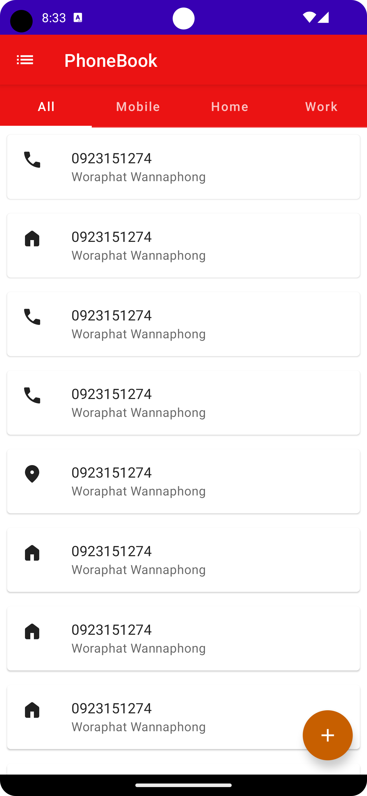
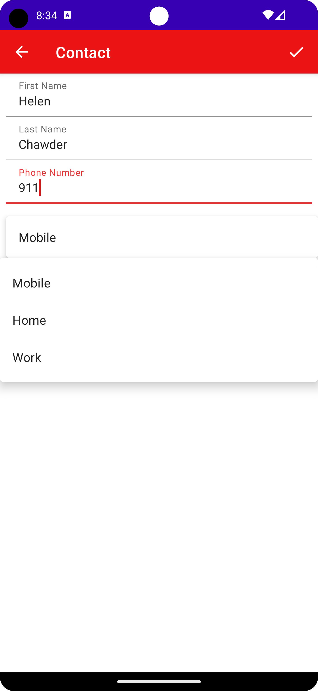
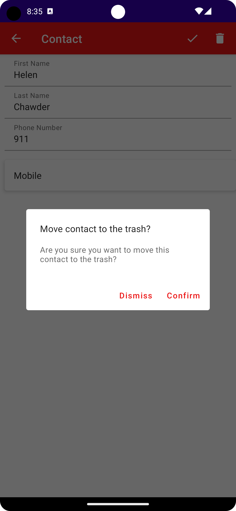
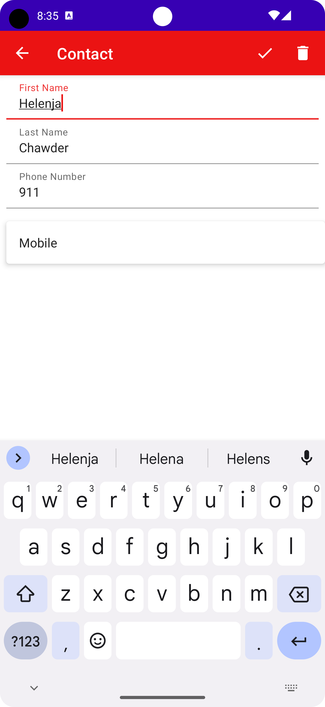

# cn333as5

## แอปพลิเคชั่นสมุดเบอร์โทรศัพท์ (Android App: PhoneBook)
- สร้างAndroid App: PhoneBook
- ผู้ใช้สามารถบันทึกเบอร์โทรศัพท์และชื่อได้
- ผู้ใช้สามารถtagไว้เลือกประเภทของเบอร์ได้
- สามารถเพิ่ม, แก้ไข, ลบ และกู้คืนเบอร์โทรศัพท์ได้

# รายชื่อ
#### Woraphat Wannaphong 6310611055

# ขั้นตอนการใช้งาน
1. git clone https://github.com/6310611055/cn333as5.git
2. Android Studio เลือก file => new => import project => เลือก file ที่ clone ไว้
3. กด Run or Shift + F10

# ตัวอย่างโปรแกรม
เมื่อทำการ Run ขึ้นมาจะแสดงหน้า home 

เมื่อผู้ใช้ทำการเพิ่มเบอร์โทรศัพท์

เลือกtagหรือหมวดตามต้องการ

ทำการลบเบอร์

ทำการแก้ไขข้อมูล

ทำการกู้คืนเบอร์

# Demo สาธิตวิธีการใช้งาน
LinkVideo=> [Click_Here]()
